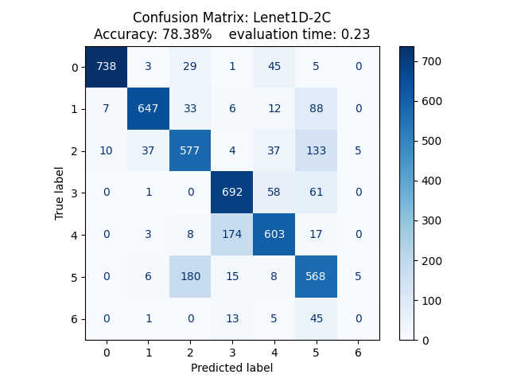
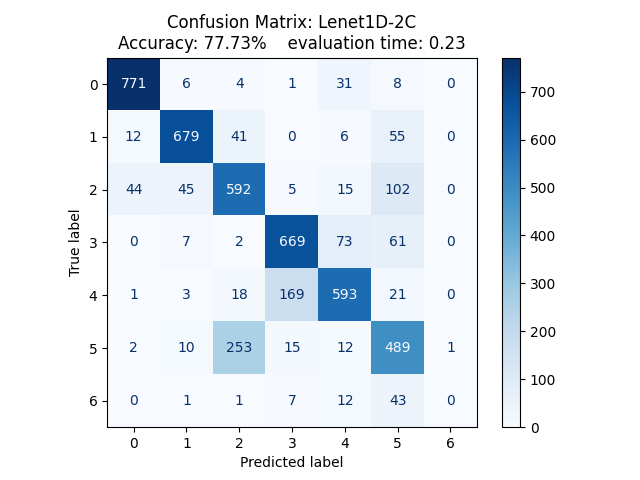
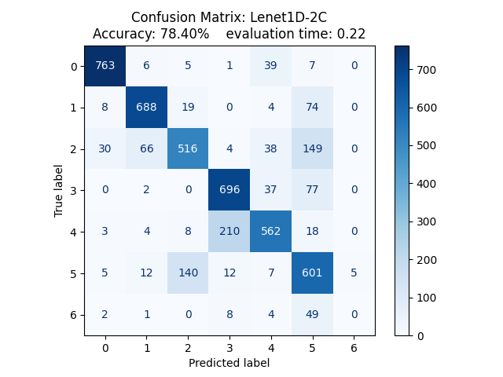

## 1. Definizione del Problema e Obiettivo

L'obiettivo di questo progetto è addestrare un modello di Deep Learning, valutandone le prestazioni nel riconoscimento dei gesti della mano.

Il compito che deve svolgere il modello è l'analisi di segnali elettromiografici, ricavati da sensori posti sull'avambraccio. La prima analisi si è svolta con un dataset ridotto, impostando così il problema come una più semplice **classificazione binaria**, dove vengono dati al modello solo due tipi di gesti da riconoscere: **Pugno** e **Mano a riposo**.

## 2. Composizione del Dataset e suddivisione dei dati

Il dataset proveniente dalla **UCI Machine Learning Repository** è composto da ben 36 cartelle, ciascuna rappresentante un individuo sottoposto alle misurazioni tramite sEMG. L'analisi è stata eseguita tramite un dispositivo con 8 sensori equidistanti che andranno a raccogliere segnali muscolari. Ad ogni partecipante e richiesto di svolgere due serie di 6/7 gesti svolti con la mano e mantenuti per 3 secondi, seguiti da una fase di riposo di 3 secondi. I risultati dei vari sensori vengono poi salvati in un file di testo composto da 10 colonne:

-   **1° Colonna**: è la **marcatura temporale**, ossia l'istante di tempo in cui viene svolta l'azione;

-   **2°- 9° Colonna**: Queste sono i valori grezzi dei **segnali** rilevati dagli 8 sensori;

-   **10° Colonna**: Questa rappresenta la **classe**, ossia l'azione svolta dal soggetto in quell'istante (*Ground Truth* che il modello userà per comprendere i gesti)

I valori della classe che si andranno ad analizzare saranno 2 (mano a pugno) e il 1 (mano a riposo), rimappate per il corretto funzionamento del modello rispettivamente come 0 ed 1. Un valutazione iniziale era di differenziare tra mano a pugno e mano aperta, questo compito però sarebbe risultato inconcludente a causa del forte sbilanciamento di dati tra le due classi, portando al modello a rispondere "mano a pugno" nella maggior parte dei casi, poiché la probabilità di trovare un caso di "mano aperta".

Approfittando della configurazione del dataset, si è optato per dividere gli individui usati per il *training* e quelli invece usati per il *testing* in modo da evitare in qualsiasi modo il ***Data Leakage.*** In particolare, i primi 24 soggetti saranno usati per allenare il modello mentre i restanti saranno usati per verificare l'allenamento di quest'ultimo. Questa configurazione permette di verificare il modello con pattern e segnali muscolari totalmente nuovi e mai visti durante la fase di training, verificandone perfettamente l'accuratezza.

### 2.1 Segmentazione dei segnali $\implies$ Windowing

Per poter utilizzare i valori grezzi dei sensori per allenare il modello di *Deep Learning* è necessario inanzitutto caricare i risultati attraverso una tecnica di segmentazione del segnale. Essa consiste nell'uso di una "finestra temporale" che scorre nel dataframe con passo di lunghezza inferiore alla grandezza di tale finestra, in modo da generare sovrapposizione tra due segmentazioni consecutive. In questo modo, si può garantire che si rilevi l'evoluzione nel tempo del segnale, mantenendo un elevato numero di campioni per l'addestramento.

Siccome alcune finestre temporali possono rilevare dati durante un periodo di transizione, dove il gesto passa da una configurazione all'altra, si definisce come gesto principale di ogni finestra, quello con il maggior numero di elementi all'interno di essa.

#### Frammento di codice dove si applica ciò che è stato definito anteriormente

```{python, echo=False}
#| eval: false

for i in range(0, len(sensor_ds) - self.window_size, self.step_size):
    #Estrazione della finestra temporale per gli 8 canali
    window = sensor_ds[i : i + self.window_size]
    
    #Assegnazione del gesto principale per ogni finestra
    window_label = np.bincount(label_ds[i : i + self.window_size]).argmax()

    # Suddivisione per soggetti (Leave-Subjects-Out)
    if int(user_id) <= 24:
        x_train.append(window)
        y_train.append(window_label)
    else:
        x_test.append(window)
        y_test.append(window_label)

```

### 2.2 Normalizzazione dei tensori

Al fine di agevolare la convergenza dell'algoritmo durante la fase di addestramento del modello, è necessaria una normalizzazione dei valori grezzi ricavati dai sensori. I segnali da valutare infatti, variano a seconda della forza impressa da ciascun individuo, per questo motivo non può essere un limite massimo e minimo come nel caso dei colori dei pixel (che vanno da 0 a 255). Date queste premesse si è optato per la normalizzazione di tali valori, calcolando media e deviazione standard del dataset, esclusa la parte dedicata alla valutazione. Questa decisione nasce per evitare che il modello abbia informazioni riguardanti il dataset di *testing*. Media e deviazione standard $\mu$ vengono successivamente applicati ad entrambi i dataset, aggiungendo a $\mu$ una costante $\epsilon= 10^{-8}$ per evitare casi in cui la deviazione standard sia pari a 0.

### Codice:

```{python, echo=False}
#| eval: false

def preprocess_data(x_train, x_test):
  # Calcolo media e deviazione standard del dataset per l'addestramento
  mean = np.mean(x_train, axis=(0,1), keepdims=True)
  std = np.std(x_train, axis=(0,1), keepdims=True)
  
  # Normalizzazione
  train_normalized = (x_train - mean) / (std + 1e-8)
  test_normalized = (x_test - mean) / (std + 1e-8)

  # Passaggio necessario per costruire i tensori
  train_tensor = torch.tensor(train_normalized, dtype=torch.float32)
  test_tensor = torch.tensor(test_normalized, dtype=torch.float32)

  # Trasposizione degli assi 
  train_tensor = train_tensor.transpose(1, 2)
  test_tensor = test_tensor.transpose(1, 2)

  return train_tensor, test_tensor

```

La trasposizione è necessaria per adeguare il tensore alla forma richiesta dal modello \[Batch, Input, window_size\] anziché \[Batch, window_size, Input\].

## 3. Composizione modello

### 3.1 1° Modello $\implies$ Lenet1D-3C

Il primo modello considerato è Lenet1D, che utilizza un'architettura CNN (*Convolutional Neural Network*) monodimensionale, ideale rispetto all'architettura bidimensionale data la struttura del nostro dataset. Questa rete neurale infatti, risulta ottima per l'analisi di pattern all'interno di dati sequenziali, come nel caso di segnali EMG.

#### 3.1.1 Struttura

Le rete neurale è strutturata su tre blocchi convoluzionali, seguiti da una classificazione lineare (*Fully connected*). Questa combinazione è scelta per permettere di estrarre i picchi dei segnali muscolari per ciascuno dei 8 valori di ingresso, mantenendo così le correlazioni temporali.

Ogni blocco convoluzionale è composto da 3 funzioni:

-   **nn.Conv1d** applica i filtri convoluzionali ad una sequenza di dati definita come *kernel*, la quale lunghezza risulta pari a quella definita da *kernel_size*. *Stride* definisce il passo dopo il quale si studierà il seguente kernel. Il *padding* serve ad aggiungere una serie di zeri ai bordi del dataset per preservare le dimensioni del segnale originale.

-   **nn.ReLU** è una funzione di attivazione la cui formula è $f(x)=max(0, x)$. Lo scopo è introdurre non linearità, fondamentale nelle reti neurali per poter risolvere problemi complessi. Inoltre, grazie a essa, si elimina la possibilità di annullamento del gradiente( *Vanishing Gradient*). Questo fenomeno si presenta quando il valore dei gradienti raggiungono lo 0 durante la *backpropagation*, non permettendo quindi al modello di aggiornare i propi pesi, bloccando il *training.*

-   **nn.MaxPool1d** svolge un sottocampionamento per ridurre la lunghezza del tensore considerato, riducendo i calcoli per i layer successivi e la sensibilità della rete neurale alle piccole variazioni temporali del segnale

**nn.Linear** è una funzione che rileva ogni *feature* estratta dalle convoluzioni precedenti e ne ricava un valore per ciascuna configurazione analizzata tramite l'equazione vettoriale $y = xA^T+b$, dove $x$ è l'input, $A$ sono i pesi contrassegnati e $b$ è il termine di bias.

```{python, echo=False}
#| eval: false

self.c1=nn.Conv1d(in_channels=8, out_channels=16, kernel_size= 5, stride= 1, 
        padding= 2)
self.r1 = nn.ReLU()
self.p1 = nn.MaxPool1d(kernel_size=2, stride=2)

#2° Blocco Convoluzionale
#input [16, 100] -> dopo conv2 -> [32, 100] -> dopo il Pool -> [32, 50]
self.c2=nn.Conv1d(in_channels=16, out_channels=32, kernel_size=5, stride=1, 
        padding=2)
self.r2=nn.ReLU()
self.p2=nn.MaxPool1d(kernel_size=2, stride=2)

#3° Blocco Convoluzionale
#input -> [32, 50] -> dopo conv3 -> [128, 1]
self.c3=nn.Conv1d(in_channels=32, out_channels=128, kernel_size=50, stride=1, 
        padding=0)
self.r3=nn.ReLU()
self.fc1= nn.Linear(128, num_classes)

```

### 3.2 2° Modello $\implies$ Lenet1D-2C

Il 2° modello è una variazione del primo, dove si elimina il terzo stadio convoluzionale. Questa variazione risulta molto più rapida da allenare data l'eliminazione di uno stadio, verificando a livello macroscopico i valori. Questa velocità compromette l'accuratezza sia quando la differenza tra due movimenti risulta meno evidente, sia quando il numero di gesti da analizzare è maggiore.

Il modello quindi risulterà più performante quando la classificazione rimane binaria, mentre quando la classificazione avverrà con moltecipli gesti, l'accuratezza del modello andranno a peggiorare.

#### 3.2.1 Struttura

Come già accennato precedentemente, lo stile e il tipo di funzioni sono identici, con unica eccezione il numero di convoluzioni ridotto. La funzione **nn.Linear** avrà quindi un maggior numero di dati da analizzare, data la mancanza di un **nn.MaxPool1d**, il quale dimezzava la dimensione del tensore

### 3.3 3° Modello $\implies$ Multi-Scale 1D

Il 3° modello ha una struttura parallela, dove il primo stadio convoluzionale genera due tensori di misure differenti. Questo metodo permette un'analisi del segnale macroscopica (variazioni temporali) e microscopica (analisi dei segnali istantanei del muscolo).

#### 3.3.1 Struttura

La struttura del modello è composta da 2 blocchi convoluzionali, separati dalla funzione **torch.cat()**.

La prima convoluzione è quella dove si scompone il dataset in due tensori, costruiti da 2 *kernel_size* differenti, i quali si concentrano su dettagli diversi del segnale. In questo modo, il modello è in grado di riconoscere il cambio di configurazione temporale e il valore delle variazioni microscopiche del segnale, portando a riconoscere con maggior facilità i vari gesti considerati

Dopo il primo stadio convoluzionale, i due tensori vengono aggregati tramite la funzione integrata *torch.cat*, la quale prende in ingresso i vari tensori e il termine per il quale concatenarli (in questo caso 1 perché rappresenta i filtri applicati al segnale, punto focale del modello parallelizzato).

Successivamente il segnale passa per iil suo ultimo stadio convolutivo, dal quale il modello non ha ulteriore differenze rispetto agli altri.

```{python, echo=False}
#| eval: false

self.c1_1= nn.Conv1d(in_channels=8, out_channels=16, kernel_size= 3, stride= 1,
          padding= 1)
self.r1_1= nn.ReLU()
self.p1_1= nn.MaxPool1d(kernel_size=2, stride=2)

#2° Ramo
self.c1_2= nn.Conv1d(in_channels=8, out_channels=16, kernel_size= 11, stride= 1, 
          padding= 5)
self.r1_2= nn.ReLU()
self.p1_2= nn.MaxPool1d(kernel_size=2, stride=2)

#3° Convoluzione comune
#si considerano 32 input perché, dopo l'unione delle due convoluzioni, 
#il numero di output si sommano
self.c2= nn.Conv1d(in_channels=32, out_channels=32, kernel_size= 5, stride= 1, 
        padding= 2)
self.r2= nn.ReLU()
self.p2= nn.MaxPool1d(kernel_size=2, stride=2)

#4° fully_connected
self.fc1= nn.Linear(32*50, num_classes)
```

## 4. Training ed evaluation

Come già definito anteriormente, per garantire che l'addestramento dell'algoritmo non influenzi la valutazione di quest'ultimo, è stato deciso di separare i dati rispetto agli individui, così che la valutazione avvenisse con segnali mai osservati e evitare l'*overfitting* per contaminazione dei dati. Seguendo questa logica sono stati separati anche i due programmi di *training* e *testing* a scopo organizzativo, migliorando l'interpretabilità di quest'ultimi.

### 4.0.1 Composizione training

Questo programma svolge il *training loop* su una serie epoche. Il suo compito è alimentare l'algoritmo convoluzionale tramite i mini-batch, per poi calcolare la differenza tra le predizioni e la *ground truth*. Al fine di calcolare tale differenza, è stata scelta come *loss_function* la **Cross_Entropy_Loss**, poiché è la più adatta per i problemi di classifcazione, aumentando il valore di *loss* in base alla gravità dell'errore di predizione. Successivamente, il valore di errore si propaga all'indietro, aggiornando il valore dei pesi tramite l'ottimizzatore **Adam**, il più popolare tra gli ottimizzatori dato che regola il *learning rate* in base ai gradienti di ciascun peso, migliorando la convergenza della predizione.

Al termine di ogni epoca, il codice stampa la loss media e l'accuratezza temporanea di addestramento, in modo da verificare ad ogni istante la convergenza ed eventuali anomalie nel processo di apprendimento.

##### Codice

```{python, echo=False}
#| eval: false

for epoch in range(EPOCHS):
    epoch_start_time = time()
    model.train()
    #usiamo r_loss per calcolare l'errore per ogni epoca in modo da capire se
    #l'errore diminuisce
    r_loss=0.0
    #usiamo correct_train e total_train per calcolare l'accuratezza 
    #del modello: Se l'accuratezza è troppo alta probabilmente sta andando in overfitting
    correct_train=0.0
    total_train=0.0

    for inputs, labels in train_loader:
        inputs, labels= inputs.to(device), labels.to(device)

        outputs = model(inputs)
        loss= loss_function(outputs, labels)

        optimizer.zero_grad()
        loss.backward()
        optimizer.step()

        r_loss += loss.item()

        #a parte il calcolo della loss si aggiunge il calcolo dell'accuratezza 
        #per ogni epoca, in modo da verificare eventuali overfittimg
        _, predicted=torch.max(outputs.data, 1)
        total_train+= labels.size(0)
        correct_train+= (predicted==labels).sum()

```

##### Configurazione di Batch_size e Learning_rate

Durante il *training* del modello, è importante definire il valore delle variabili **Batch_size** e **Learning_rate**. Modificando il *batch_size*, possiamo variare la dimensione del tensore dei gradienti: se esso risulta troppo piccolo, l'addestramento diventa più lento, mentre se il valore è troppo alto, la dimensione del tensore diventa troppo grande per essere contenuto all'interno della VRAM, portando il codice in crash (Cuda Out of Memory).

Modificando il *learning_rate*, si varia la velocità di variazione dei pesi dell'ottimizzatore. Se il valore è troppo piccolo, il modello impiegherà molto tempo per ridurre l'errore minimo, mentre se il valore è troppo alto, la *loss* diverge, non raggiungendo mai un valore di errore soddisfacente.

### 4.0.2 Composizione *testing*

Questo programma carica i pesi ottimali precedentemente ottenuti dal *training* e successivamente salvati all'interno del file *emg_lenet1d.pth* per poi procedere con la valutazione del modello tramite la funzione `model.eval()`, accompagnata da `torch.no_grad()` affinché l'algoritmo non calcoli il gradiente dei tensori, non unitlizzati durante la valutazine. Una volta completata la valutazione, il programma procede a stampare a schermo il risultato di accuratezza finale, da cui poi si concluderà se il modello è affidabile.

##### Codice

```{python, echo=False}

#| eval: false

with torch.no_grad():
    correct = 0
    total = 0
    
    #Ciclo sui dati del Test Set (gli utenti rimasti fuori dall'addestramento)
    for inputs, labels in test_loader:
        inputs, labels = inputs.to(device), labels.to(device)
        
        # Passaggio in avanti
        outputs = model(inputs)
        
        # Troviamo il gesto con il punteggio più alto (0 o 1)
        _, predicted = torch.max(outputs.data, 1)
        
        # Accumuliamo il totale delle finestre e quelle indovinate
        total += labels.size(0)
        correct += (predicted == labels).sum().item()

```

## 5. Considerazioni sui risultati

### 5.1 Classificazione binaria

#### 1° Modello $\implies$ Lenet1D-3C

Analizzando i temi di addestramento e l'accuratezza per ciascuna epoca, si può notare come la durata della prima epoca, nonché la sua accuratezza, sono drasticamente diverse rispetto alle restanti. Questo comportamento irregolare è dovuto principalmente ad operazioni all'**allocazione della memoria(RAM/VRAM)**, dove Pytorch richiede l'assegnazione di blocchi di memoria contigui all'interno della VRAM della GPU nel quale saranno caricati i tensori dei batch e i pesi dell'ottimizzatore. Questa esecuzione non avviene per ogni epoca, ma solo durante la prima richiesta, dopo la quale si andranno ad aggiornare gli stessi blocchi.

```{python, echo=False}
#| eval: false

Epoch [1/15],    Loss: 0.2429,   Acc: 89.7468,   elapsed time: 0.3618 seconds
Epoch [2/15],    Loss: 0.0766,   Acc: 97.3132,   elapsed time: 0.1217 seconds
Epoch [3/15],    Loss: 0.0482,   Acc: 98.5485,   elapsed time: 0.1213 seconds
Epoch [4/15],    Loss: 0.0315,   Acc: 99.0117,   elapsed time: 0.1202 seconds
Epoch [5/15],    Loss: 0.0194,   Acc: 99.3515,   elapsed time: 0.1194 seconds
Epoch [6/15],    Loss: 0.0167,   Acc: 99.4750,   elapsed time: 0.1191 seconds
Epoch [7/15],    Loss: 0.0099,   Acc: 99.7838,   elapsed time: 0.1122 seconds
Epoch [8/15],    Loss: 0.0067,   Acc: 99.9073,   elapsed time: 0.1087 seconds
Epoch [9/15],    Loss: 0.0047,   Acc: 99.9382,   elapsed time: 0.1042 seconds
Epoch [10/15],   Loss: 0.0041,   Acc: 99.9691,   elapsed time: 0.1061 seconds
Epoch [11/15],   Loss: 0.0027,   Acc: 99.9691,   elapsed time: 0.1088 seconds
Epoch [12/15],   Loss: 0.0022,   Acc: 99.9691,   elapsed time: 0.1092 seconds
Epoch [13/15],   Loss: 0.0015,   Acc: 99.9691,   elapsed time: 0.1120 seconds
Epoch [14/15],   Loss: 0.0012,   Acc: 100.0000,  elapsed time: 0.1140 seconds
Epoch [15/15],   Loss: 0.0010,   Acc: 100.0000,  elapsed time: 0.1096 seconds
Training completed in 1.9601 seconds
```

Dopo aver concluso la valutazione, LeNet-1D ha raggiunto un'accuratezza finale di $97.86\%$ in un tempo di $0.1807s$. Si può affermare che questo risultato non è dovuto a *Data Leakage* grazie a tutte le decisioni riguardanti l'isolamento dei dataset. Inoltre, da un risultato così elevato, si conclude che il numero di epoche selezionato è attorno al valore ideale, poiché il modello non è andato in *overfitting*.

#### 2° Modello $\implies$ Lenet1D-2C

```{python}
#| eval: false

Epoch [1/15],    Loss: 0.3250,   Acc: 83.5392,   elapsed time: 0.3279 seconds
Epoch [2/15],    Loss: 0.0909,   Acc: 97.1587,   elapsed time: 0.0963 seconds
Epoch [3/15],    Loss: 0.0672,   Acc: 97.9617,   elapsed time: 0.0911 seconds
Epoch [4/15],    Loss: 0.0536,   Acc: 98.3941,   elapsed time: 0.0875 seconds
Epoch [5/15],    Loss: 0.0464,   Acc: 98.7029,   elapsed time: 0.0911 seconds
Epoch [6/15],    Loss: 0.0387,   Acc: 98.7647,   elapsed time: 0.0935 seconds
Epoch [7/15],    Loss: 0.0349,   Acc: 98.7956,   elapsed time: 0.0881 seconds
Epoch [8/15],    Loss: 0.0248,   Acc: 99.1970,   elapsed time: 0.0925 seconds
Epoch [9/15],    Loss: 0.0272,   Acc: 99.0735,   elapsed time: 0.0890 seconds
Epoch [10/15],   Loss: 0.0196,   Acc: 99.2588,   elapsed time: 0.0988 seconds
Epoch [11/15],   Loss: 0.0165,   Acc: 99.4750,   elapsed time: 0.0861 seconds
Epoch [12/15],   Loss: 0.0173,   Acc: 99.4441,   elapsed time: 0.0911 seconds
Epoch [13/15],   Loss: 0.0139,   Acc: 99.4750,   elapsed time: 0.0910 seconds
Epoch [14/15],   Loss: 0.0110,   Acc: 99.6912,   elapsed time: 0.0889 seconds
Epoch [15/15],   Loss: 0.0091,   Acc: 99.8147,   elapsed time: 0.0887 seconds
Training completed in 1.6152 seconds
```

Accuratezza finale è del $98.74 \%$ eseguita in $0.1598s$.

#### 3° Modello $\implies$ Multi-Scale1D

```{python}
#| eval: false

Epoch [1/15],    Loss: 0.3011,   Acc: 85.6702,   elapsed time: 0.3614 seconds
Epoch [2/15],    Loss: 0.0754,   Acc: 97.8073,   elapsed time: 0.1112 seconds
Epoch [3/15],    Loss: 0.0429,   Acc: 98.7338,   elapsed time: 0.1068 seconds
Epoch [4/15],    Loss: 0.0318,   Acc: 99.1662,   elapsed time: 0.1032 seconds
Epoch [5/15],    Loss: 0.0238,   Acc: 99.2279,   elapsed time: 0.1055 seconds
Epoch [6/15],    Loss: 0.0161,   Acc: 99.4132,   elapsed time: 0.1053 seconds
Epoch [7/15],    Loss: 0.0140,   Acc: 99.5985,   elapsed time: 0.1053 seconds
Epoch [8/15],    Loss: 0.0093,   Acc: 99.7221,   elapsed time: 0.1030 seconds
Epoch [9/15],    Loss: 0.0080,   Acc: 99.7838,   elapsed time: 0.1033 seconds
Epoch [10/15],   Loss: 0.0057,   Acc: 99.9073,   elapsed time: 0.1113 seconds
Epoch [11/15],   Loss: 0.0046,   Acc: 99.9691,   elapsed time: 0.1045 seconds
Epoch [12/15],   Loss: 0.0037,   Acc: 99.9691,   elapsed time: 0.1026 seconds
Epoch [13/15],   Loss: 0.0032,   Acc: 99.9691,   elapsed time: 0.1020 seconds
Epoch [14/15],   Loss: 0.0027,   Acc: 99.9691,   elapsed time: 0.1023 seconds
Epoch [15/15],   Loss: 0.0023,   Acc: 99.9691,   elapsed time: 0.1107 seconds
Training completed in 1.8511 seconds
```

Accuratezza finale è del $98.36 \%$ eseguita in $0.1929s$.

#### Considerazioni e comparazioni

Confrontando i risultati ottenuti dai tre modelli considerati, si può notare che per una classficazione binaria il risultato migliore sia ottenuto dal modello Lenet1D a due convoluzioni, garantendo l'accuratezza più alta con il tempo di training minore. Questo risultato era prevedibile e concorde alle caratteristiche del modello, dato che i tipi di gesti considerazioni sono molto differenti tra loro e non c'è necessità di analizzare a fondo i segnali per verificare anche i picchi improvvisi.

### 5.2 Classificazione a 7 gesti

Per considerare bene i rsultati ottenuti è necessario inanzitutto definire quali sono i gesti analizzati: 0-mano a riposo, 1-mano a pugno, 2-flessione del polso, 3-estensione del polso, 4-deviazioni radiali, 5-deviazioni ulnirali e 6-mano aperta. L'ultima configurazione non è stata svolta da tutti i partecipanti, perciò l'accuratezza calerà per quella determinata configurazione.

Siccome il numero di configurazioni da analizzare sono maggiori, si utilizza la **matrice di confusione** per migliorare la lettura e la comprensione dell'accuratezza della predizione in base alla configurazione stessa.

#### 1° Modello $\implies$ Lenet1D-3C

{width="90%"}

Tempo di training è di $5.2802s$

#### 2° Modello $\implies$ Lenet1D-2C

{width="90%"}

Tempo di training è di $4.5609s$

\newpage

#### 3° Modello $\implies$ Multi-Scale1D

{width="90%"}

Tempo di training è di $5.3605s$.

#### Considerazioni e comparazioni

L'aumento della complessità dell'analisi da 2 a 7 gesti ha provocato tempi di training leggermente più alti, facendo notare il maggior carico richiesto per poter definire con più accuratezza le varie configurazioni. Dai risultati raccolti si possono fare alcune considerazioni sulle principali caratteristiche, individuabili sui risultati di tutti e tre i modelli:

-   per la configurazione 6 (mano aperta), nessuno dei tre modelli è stato in grado di predirla. Questa mancanza è un fenomeno particolare che avviene per colpa di uno **sbilanciamento del dataset**. Come già definito da chi l'ha pubblicato, esso ha pochi dati riguardanti tale gesto, provocando che il modello non possa estrarre sufficienti *feature* e quindi classificare in maniera erronea tale movimento.

-   Le configurazioni 2 e 5(flessione del polso e deviazione ulnirale), nonché 3 e 4 (estensione del polso e deviazione radiale), sono spesso confuse tra loro nel modello. Questo fenonemo è causato da **sinergia muscolare dei movimenti** e **bassa risoluzione degli strumenti di misura**. I muscoli che vengono attivati durante lo svolgimento di tali coppie sono molto simili tra loro, provocando che il modello spesso si confonda. Per la precisione, la coppia 2-5 condivide l'attivazione del muscolo flessore ulnare del carpo, mentre la coppia 3-4 condivide l'attivazione degli estensori radiali del carpo. Siccome le fibre muscolari sono sovrapposte tra loro, i sensori notano segnali sovrapposti, che generano errate letture nel modello.

Per questa configurazione, il modello Lenet1D-2C, seppur mantendendo un tempo di allenamento rapido, è quello che presenta una minor accuratezza finale, anche se di poco. Il miglior modello per accuratezza è il modello Multi-Scale1D, che ottiene un risultato di $78,40\%$.
